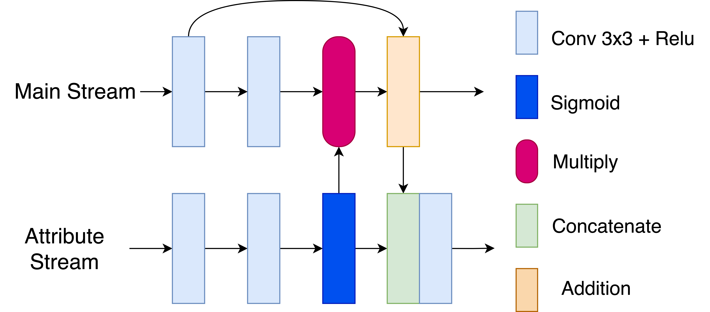
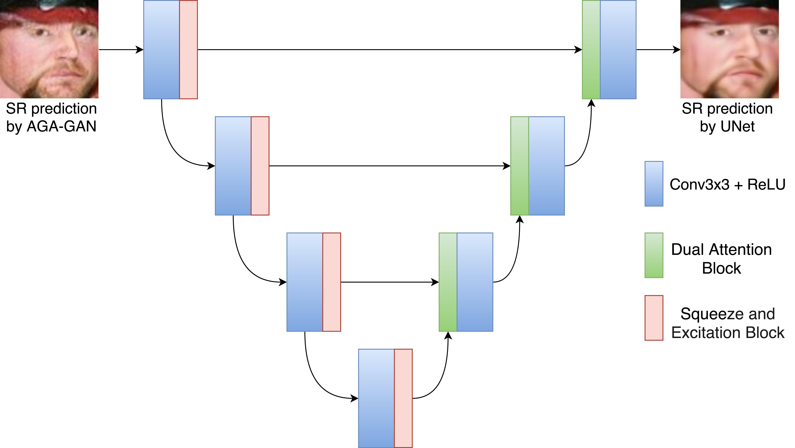

# AGA-GAN
# AGA-GAN: Attribute Guided Attention Generative Adversarial Network with U-Net for Face Hallucination
This repository provides code for our paper "AGA-GAN: Attribute Guided Attention Generative Adversarial Network with U-Net for Face Hallucination" ([arxiv version](https://arxiv.org/abs/2111.10591))  
## 2.) Overview
### 2.1.)Introduction
In this paper, we propose AGA-GAN(Attribute Guided Attention Generative Adversarial Network) which uses a novel attention mechanism to identify the spatial location of key facial attributes and focus the generation process to successfully recover salient facial elements. The AGA-GAN allows the attribute descriptors to learn their spatial position in the image domain using the attribute stream. The attribute streams interact with the main generation stream to allow feature maps carrying information about several facial elements to be incorporated in the final HR prediction. Attention maps generated by the attribute stream enable the main generation stream to focus on the spatial locations of essential features and also provide additional information about the description of facial elements. Feedback from the main generation stream allows the attribute stream to generate attention maps progressively focusing on various facial structures. Consequently, the super-resolved (SR) prediction possesses a high degree of fidelity and enjoys high-frequency details demonstrating superior visual quality. Apart from that, we design a spatial and channel attention-based U-Net for enhancing the visual quality by refinement of facial features and even rectification of visual artifacts present in SR prediction by AGA-GAN. It can be noted that apart from demonstrating a high degree of fidelity, the use of the U-Net module successively after AGA-GAN improves the quantitative performance


## 2.2.) Progressive Attribute Guided Attention Block


## 2.3.) Architecture of our Attribute Guided Attention Generative Adversarial Network


## 2.4.) Architecture of our dual attention U-Net for refining super-resolved images


## 2.5.) Qualitative results for 8x upsampling


## 3.) Training and Testing
## 3.1)Data Preparation
1.) make directory named "celebA_128"

2.) Align the faces using mtcnn


## 3.2) Training AGA-GAN
Model architecture is defined in `aagan_8x.py`

Train AGA-GAN as:

`python aagan_8x.py`

Test using:

`python agagan_test.py`

## 3.2)Training AGA-GAN and UNet
For training and testing the AGA-GAN+Unet run:

`python agagan_unet.py`

## 4.) Citation
Please cite our paper if you find the work useful:

```
@article{srivastava2021aga,
  title={AGA-GAN: Attribute Guided Attention Generative Adversarial Network with U-Net for Face Hallucination},
  author={Srivastava, Abhishek and Chanda, Sukalpa and Pal, Umapada},
  journal={arXiv preprint arXiv:2111.10591},
  year={2021}
}

```
## 5.) FAQ
Please feel free to contact me if you need any advice or guidance in using this work ([E-mail](abhisheksrivastava2397@gmail.com)) 
